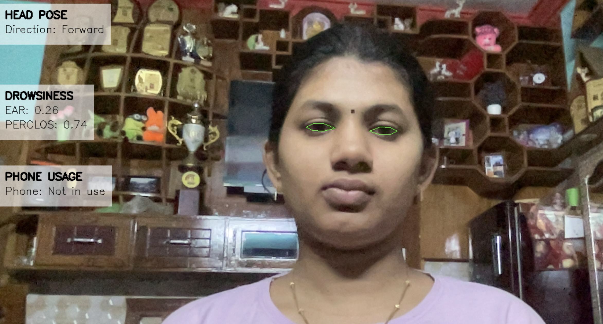
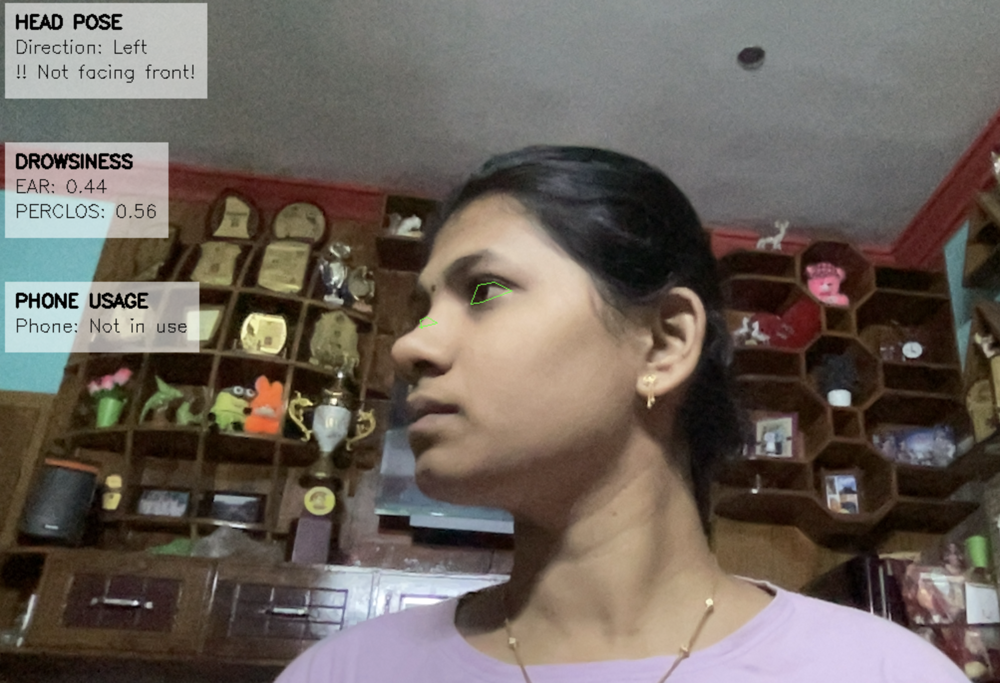
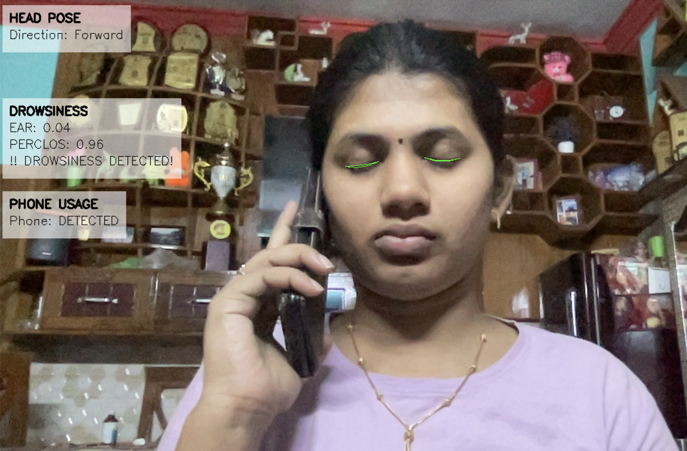

# Driver Monitoring System using Computer Vision (ADAS)

This project implements a real-time **Driver Monitoring System** using computer vision and deep learning techniques. The system detects signs of **driver drowsiness**, **head pose direction**, and **mobile phone usage**, aiming to improve road safety and serve as a prototype for ADAS (Advanced Driver Assistance Systems).

## 📌 Project Objective

The goal of this system is to monitor a driver's attention level using a webcam. By combining facial landmark analysis, head pose estimation, and object detection, the system detects distracted driving behavior such as:

- Eye closure (drowsiness)
- Looking away from the road
- Using a mobile phone while driving

This can serve as a critical component of any driver safety or in-vehicle alert system.

## 🎯 Features

### 👁️ Drowsiness Detection
- Uses **MediaPipe FaceMesh** to extract facial landmarks.
- Calculates the **Eye Aspect Ratio (EAR)** to determine if eyes are closed.
- Raises an alert if eyes remain closed for a threshold period.

### 🧠 Head Pose Estimation
- Estimates driver’s gaze direction (left, right, forward).
- Based on 3D landmark mapping and projection of nose direction.
- Useful to detect if driver is looking away from the road.

### 📱 Phone Usage Detection
- Integrates a YOLOv5 object detection model to detect if the driver is holding a **cell phone**.
- Triggers a warning when a phone is detected in the frame.

---

## 🧠 Technologies Used

| Component               | Library/Framework         |
|------------------------|----------------------------|
| Face landmark detection| MediaPipe (FaceMesh)       |
| Drowsiness detection   | OpenCV, NumPy              |
| Head pose estimation   | OpenCV, NumPy              |
| Object Detection       | YOLOv5 (PyTorch)           |
| Real-time processing   | OpenCV                     |
| Environment management | virtualenv / venv          |

---

## 📂 Project Structure

```
Full-system/
├── yolov5/                          # YOLOv5 model directory
├── venv/                            # Virtual environment (ignored)
├── utils/                           # (Optional) utility/helper files
├── __pycache__/                     # Python cache (ignored)
├── demo.py                          # Test/demo script
├── drowsiness_detector.py          # Detects eye closure via EAR
├── head_pose_estimator.py          # Calculates head orientation
├── phone_detector.py               # YOLO-based phone detection
├── main.py                          # Main integration script
├── requirements.txt                 # Python dependencies
├── yolov5s.pt                       # YOLOv5 pretrained weights (ignored)
├── shape_predictor_68_face...dat   # Optional model file
└── .gitignore                       # Specifies files to ignore in Git
```

---

## 🚀 Getting Started

### 1. Clone the repository

```bash
git clone https://github.com/yourusername/driver-monitoring-system.git
cd driver-monitoring-system
```

### 2. Set up a virtual environment

```bash
python -m venv venv
source venv/bin/activate      # Linux/Mac
venv\Scripts\activate         # Windows
```

### 3. Install required dependencies

```bash
pip install -r requirements.txt
```

### 4. Download YOLOv5 Weights

Place the `yolov5s.pt` model in the project root.  
You can download it from [YOLOv5 GitHub Releases](https://github.com/ultralytics/yolov5/releases).

### 5. Run the system

```bash
python main.py
```

This will launch your webcam and start monitoring.

---

## 📄 .gitignore

To avoid uploading unnecessary files to GitHub, the following items are ignored:

```
__pycache__/
venv/
*.pt
*.pyc
.DS_Store
*.log
shape_predictor_68_face_landmarks.dat
```

---

## ⚙️ Requirements

Install dependencies from `requirements.txt`. Typical libraries used:

- opencv-python
- numpy
- mediapipe
- torch
- torchvision
- yolov5 (add as submodule or directory)
- imutils

> You may need to install YOLOv5 manually or include it as a subdirectory clone.

---

## 🔍 Detection Logic

### Drowsiness Detection:
- Uses EAR (Eye Aspect Ratio)
- If EAR remains below threshold for X seconds → Drowsiness alert

### Head Pose:
- 3D nose vector is projected to detect direction
- Direction: LEFT, RIGHT, FORWARD

### Phone Detection:
- YOLOv5 checks for `cell phone` label
- If confidence exceeds threshold → Phone in use alert

---
### Output:




## 🤝 Contribution

Want to contribute? Great!

- Fork this repository
- Make your changes
- Submit a pull request

Bug reports, suggestions, and feature requests are welcome too!

## 🙏 Acknowledgements

- [YOLOv5 by Ultralytics](https://github.com/ultralytics/yolov5)
- [MediaPipe by Google](https://mediapipe.dev/)
- [OpenCV Library](https://opencv.org/)

